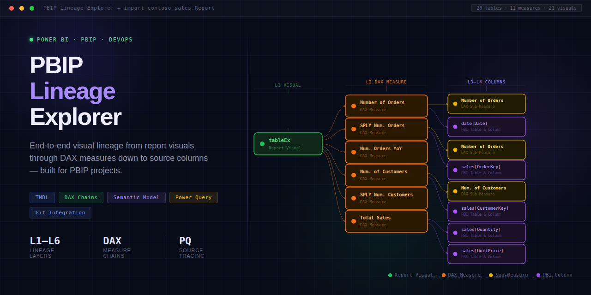

# PBIP Lineage Explorer

**Stop spending hours manually tracing DAX dependencies — or wondering what changed in a colleague's last commit.** Open your PBIP folder and get instant lineage tracing + commit-by-commit change intelligence.

 Built by a **Microsoft MVP** · Free forever · 100% client-side · [MIT License](LICENSE)

> **No PBIP file?** [Try it now with built-in sample data](https://jonathanjihwankim.github.io/pbip-lineage-explorer/) — no setup required.

---

## The Problem

- You rename a column and 3 reports break. **You have no idea which ones.**
- You need to trace a KPI back to its source columns. You click through **Power BI Desktop for an hour.**
- A colleague commits changes to the `.Report` folder — **you have no idea what visuals, filters, or measures changed.**
- Someone modifies a shared measure — **you don't know which visuals are impacted downstream.**
- You need to document lineage for a data engineer. You open **47 TMDL files** and start copy-pasting.

**Each of these takes hours. This tool does it in seconds.**

| | Manual | PBIP Lineage Explorer |
|---|---|---|
| Visual → measure → column chain | Copy-paste across dozens of files | **One-click interactive graph** |
| Impact analysis ("what breaks?") | Not feasible at scale | **One click** |
| What changed in the last 5 commits? | Diff raw JSON by hand | **Automatic change report** |
| Downstream impact of a measure edit | Hope and pray | **Traced through refs, field params & calc groups** |
| Source column mapping before rename | Spreadsheet archaeology | **Automatic** |

---

## What You Get

### Lineage Tracking

- **Visual-to-source lineage in one click** — trace any measure or visual through its full dependency chain
- **DAX dependency tree** — see every referenced measure and column with syntax-highlighted DAX
- **Impact analysis** — select any node to instantly see what breaks if you change it
- **Page layout minimap** — see every visual on a report page, positioned exactly as in Power BI, and click to trace lineage
- **Source column mapping** — flat table showing PBI Column → Source Column with full rename chain tracking
- **Orphan detection** — find measures that no visual references
- **Field parameter & calculation group detection** — advanced patterns identified automatically
- **Export** — SVG, PNG, CSV, Markdown, or copy lineage to clipboard

### Change Intelligence

- **Commit-by-commit change detection** — see exactly what changed across pages, visuals, filters, measures, and bookmarks
- **21 change types across 5 scopes** — from page add/remove to measure expression edits to visual field binding changes
- **Downstream impact tracing** — when a measure changes, see every visual affected through direct refs, field parameters, and calculation groups
- **Human-readable descriptions** — no raw JSON diffs, just plain-language summaries like "Measure [Revenue] expression changed in table 'Finance'"
- **Works in browser and VS Code** — same detection engine, both platforms

> Your files never leave your browser. All parsing happens client-side — nothing is uploaded anywhere.

---

## Quick Start

1. Open **[jonathanjihwankim.github.io/pbip-lineage-explorer](https://jonathanjihwankim.github.io/pbip-lineage-explorer/)**
2. Click **Open Project Folder** and select your PBIP project root (the folder with `.SemanticModel` and `.Report` subfolders)
3. Click any measure or visual in the sidebar to trace its lineage
4. Use **Export** buttons to save the lineage graph as SVG/PNG or source mappings as CSV

> Requires **Chrome 86+** or **Edge 86+** ([File System Access API](https://developer.mozilla.org/en-US/docs/Web/API/File_System_API)). Firefox and Safari are not supported.

---

## Support This Project

This tool is **free forever** — no premium tiers, no paywalls, no ads. Built and maintained solo by [Jihwan Kim](https://github.com/JonathanJihwanKim) (Microsoft MVP).

If PBIP Lineage Explorer saves you even 30 minutes of lineage tracing, please consider sponsoring. **Your support is the only funding this project has.**

**Funding goal: 0 / 200 EUR per month** `░░░░░░░░░░░░░░░░░░░░ 0%`

 

| Tier | Amount | Recognition |
|------|--------|-------------|
| **Gold** | 50+ EUR/mo | Logo + link on README and app footer |
| **Silver** | 10+ EUR/mo | Name + link on README |
| **Coffee** | One-time | Name listed below |

### Hall of Sponsors

> **Be the first!** Your name, logo, or company will appear right here. [Become a sponsor](https://github.com/sponsors/JonathanJihwanKim) and join the wall.

---

## VS Code Extension

Also available as a VS Code extension for developers who work directly in PBIP/TMDL files.

- Search **"PBIP Lineage Explorer"** in the VS Code Extensions marketplace
- Auto-activates when your workspace contains `.tmdl` files
- **Sidebar panels**: Measure Explorer, Orphan Measures, Model Stats, **Change History**
- **CodeLens**: inline "Trace Lineage" links above measure definitions
- **Change History panel**: auto-scans recent commits, shows changes grouped by commit → scope → detail with impact badges

---

## Also by Jihwan Kim

| Tool | Description |
|------|-------------|
| [PBIP Documenter](https://jonathanjihwankim.github.io/pbip-documenter/) | Generate full documentation from PBIP/TMDL semantic models |
| [PBIR Visual Manager](https://jonathanjihwankim.github.io/isHiddenInViewMode/) | Manage visual properties in Power BI PBIR reports |
| [PBIP Impact Analyzer](https://jonathanjihwankim.github.io/pbip-impact-analyzer/) | Analyze dependencies and safely refactor semantic models |

---

## More

- [Detailed reference guide](docs/reference.md) — UI overview, keyboard shortcuts, use cases, folder structure
- [Contributing](CONTRIBUTING.md) — development setup and PR guidelines
- [License](LICENSE) — MIT

---

If PBIP Lineage Explorer helps your team, please [sponsor the project](https://github.com/sponsors/JonathanJihwanKim) to keep it free and actively maintained.

 
